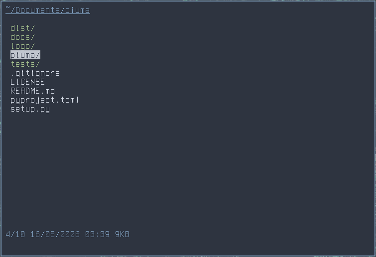

# lfb

lfb aims to be a fast, simple, and highly configurable file browser while taking advantage of Python's flexibility. lfb has snappy terminal UI with its own rendering engine as well as configurable Vim-inspired macros and icons.


> **Note**
>
> lfb is still under active development. More features, cleanup, documentation, and configuration options are planned.

## Example



## Features

- Vim-inspired navigation
- Open files with external programs
- Copy, move, rename, and delete files
- Configurable keybindings
- User configuration file
- Optional file icons
- Hidden file toggling

## Installation

Build from source:

```bash
git clone https://github.com/Emit07/lfb
cd lfb
pip install .
```

To run it:

```bash
lfb
```

## Configuration

User configuration files live in `~/.config/lfb/`:

```text
~/.config/lfb/config.toml
~/.config/lfb/keymap.toml
```

If a file is missing, lfb falls back to the bundled defaults shipped with the package.

## Design Goals

lfb is built around a few simple ideas:

- Stay lightweight and responsive.
- Keep startup and rendering fast.
- Make it customizable.
- Remain simple and easy to extend

## Roadmap

- Remove the Click dependency
- Improve documentation
- Refactor and clean up the codebase
- Expand configuration options
- Improve rendering performance
- Rename the project

## Contributing

Issues, bug reports, and pull requests are welcome.

The codebase is still evolving, so expect occasional refactors and breaking changes.
